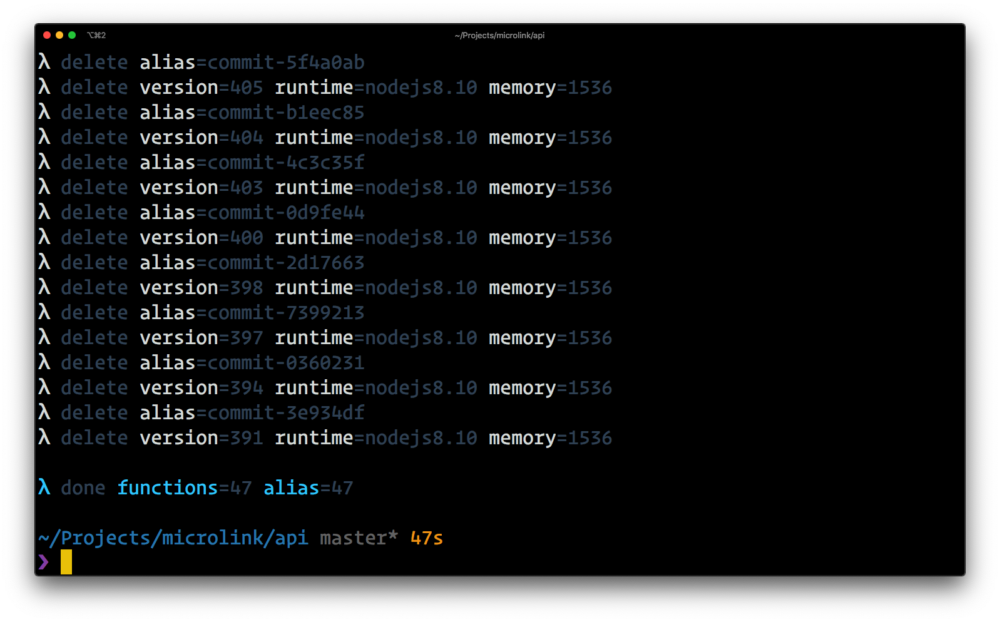

# lambda-prune

<div align="center">
  
</div>


[](https://travis-ci.com/Kikobeats/lambda-prune)
[](https://david-dm.org/Kikobeats/lambda-prune)
[](https://david-dm.org/Kikobeats/lambda-prune#info=devDependencies)
[](https://www.npmjs.org/package/lambda-prune)

> Cleanup old AWS Lambda functions.

## Usage

```bash
$ npx lambda-prune
```

## License

**lambda-prune** © [Kiko Beats](https://kikobeats.com), released under the [MIT](https://github.com/Kikobeats/lambda-prune/blob/master/LICENSE.md) License.<br>
Authored and maintained by Kiko Beats with help from [contributors](https://github.com/Kikobeats/lambda-prune/contributors).

> [kikobeats.com](https://kikobeats.com) · GitHub [Kiko Beats](https://github.com/Kikobeats) · Twitter [@Kikobeats](https://twitter.com/Kikobeats)
